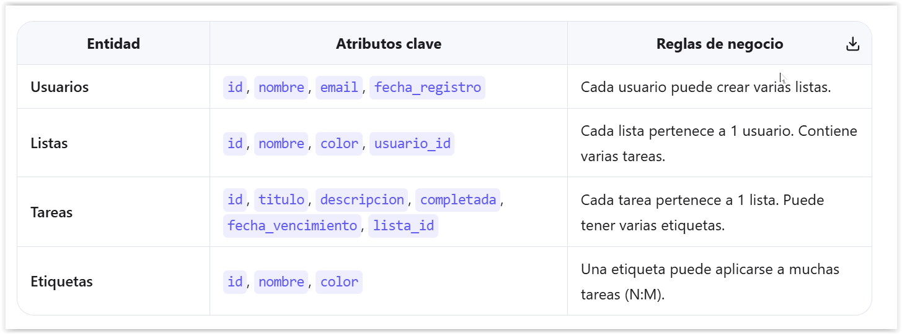
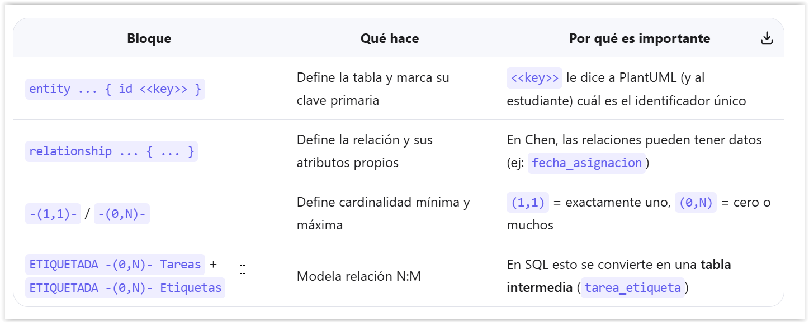

[](https://classroom.github.com/a/yQObEISy)
[](https://classroom.github.com/open-in-codespaces?assignment_repo_id=23936390)
# Modelado de datos - Diagramas Entidad Relación y Modelo lógico con PlantUML

Este repositorio contiene ejercicios prácticos para aprender a crear **Entidad Relación** y **Modelo lógico** utilizando PlantUML.

## Objetivos de Aprendizaje
Al finalizar, el estudiante será capaz de:

- ✅ Identificar entidades, atributos y claves primarias en un contexto real. 
- ✅ Representar relaciones 1:N y N:M con sintaxis @startchen.
- ✅ Entender cómo una relación conceptual se traduce a tablas SQL.
- ✅ Validar su diagrama sin errores de sintaxis.

## Contexto del Proyecto: "TaskFlow"
Vamos a crear una el modelo de datos para una aplicación web sencilla. Esta app deberá permitir organizar tareas personales y colaborativas.

## Entidades de la app



📋 Requisitos (Mapeados a 4 tablas)

## 📁 Estructura del Proyecto

```
./
├── ejercicios/                    # Ejercicios a realizar
│   ├── ejercicio-1-diagrama-der-taskflow.md
│   ├── ejercicio-2-relaciones-taskflow.md
│   └── ejercicio-3-modelo-logico-taskflow.md
├── diagramas/                     # Carpeta donde crear los diagramas
│   └── der/                      # Diagramas ER (.puml)
├── tests/                        # Pruebas automatizadas (no modificar)
│   └── ejercicio/
├── .github/workflows/            # Autograding de GitHub Classroom
└── package.json                  # Dependencias del proyecto
```

## 📚 Ejercicios

| # | Ejercicio | Descripción |
|---|-----------|-------------|
| 1 | [Diagrama ER (Chen)](ejercicios/ejercicio-1-diagrama-der-taskflow.md) | Crear las cuatro entidades base de TaskFlow con sus atributos en notación Chen |
| 2 | [Relaciones y Cardinalidad](ejercicios/ejercicio-2-relaciones-taskflow.md) | Agregar relaciones entre entidades y definir su cardinalidad (1:N y N:M) |
| 3 | [Modelo Lógico](ejercicios/ejercicio-3-modelo-logico-taskflow.md) | Crear el modelo lógico con tipos de datos, claves primarias y notación crow's foot |

---

## Conceptos Claves
- **Diagrama ER (Entidad-Relación)**: Representa la estructura de datos de un sistema, mostrando entidades, atributos y relaciones.
- **Notación Chen**: Estilo de diagrama ER que utiliza rectángulos para entidades y líneas para relaciones.



## 🛠️ Herramientas Necesarias

### PlantUML en VS Code

1. **Instala la extensión "PlantUML"** en VS Code
2. **Vista previa**:
   - Usa `Ctrl+Shift+P` → `PlantUML: Preview Current Diagram`
   - O presiona `Alt+D` para vista previa rápida

---

## ⚡ Ejecución de Pruebas

### Ejecutar todas las pruebas
```bash
npm install
npm test
```

### Ejecutar ejercicios específicos
```bash
# Ejercicio 1 - Diagrama ER (Chen)
npm test tests/ejercicio/1-diagrama-der-taskflow.test.js

# Ejercicio 2 - Relaciones y Cardinalidad
npm test tests/ejercicio/2-relaciones-taskflow.test.js

# Ejercicio 3 - Modelo Lógico
npm test tests/ejercicio/3-modelo-logico-taskflow.test.js
```

---

## 📝 Cómo Usar Este Repositorio

1. **Acepta la asignación** de GitHub Classroom
2. **Clona el repositorio** en tu máquina local o Codespace
3. **Instala dependencias**: `npm install`
4. **Lee las instrucciones** en los archivos `.md` de la carpeta `ejercicios/`
5. **Crea tus diagramas** PlantUML en la carpeta `diagramas/der/`
6. **Ejecuta las pruebas** con `npm test` para verificar tu trabajo
7. **Previsualiza** tus diagramas con `Alt+D` en VS Code
8. **Haz commit y push** para obtener tu calificación automática

---

## 📖 Recursos de Aprendizaje

### Diagramas de Clases
- [PlantUML - Diagramas de Clases](https://plantuml.com/es/class-diagram)
- [PlantUML - Notas y Comentarios](https://plantuml.com/es/commons)

---

### Revisión de Resultados
Los resultados se muestran automáticamente en:
- ✅ GitHub Actions (pestaña "Actions")
- ✅ Pull Request checks
- ✅ Cada push al repositorio

---

## 💡 Consejos para el Éxito

1. **Lee las instrucciones completas** antes de comenzar
2. **Respeta mayúsculas y minúsculas** en nombres de clases y atributos
3. **Verifica la sintaxis** con la vista previa de PlantUML
4. **Ejecuta los tests frecuentemente** para verificar tu progreso
5. **Comienza por el Ejercicio 1** antes de intentar el 2
6. **Usa comentarios** para organizar tu código PlantUML
7. **Consulta los recursos** si tienes dudas sobre UML

---

## 🆘 Solución de Problemas

### Los tests no pasan
- Verifica que el nombre del archivo sea exacto
- Revisa que estés usando la sintaxis correcta de PlantUML
- Asegúrate de que todas las clases tengan los atributos requeridos
- Verifica las multiplicidades en las relaciones

### No veo la vista previa
- Instala la extensión PlantUML en VS Code
- Verifica que el archivo tenga extensión `.puml`
- Prueba con `Ctrl+Shift+P` → `PlantUML: Preview Current Diagram`

### Problemas con npm install
- Asegúrate de tener Node.js instalado (v18 o superior)
- Intenta eliminar `node_modules` y ejecutar `npm install` de nuevo

---

¡Buena suerte modelando estructuras de datos!