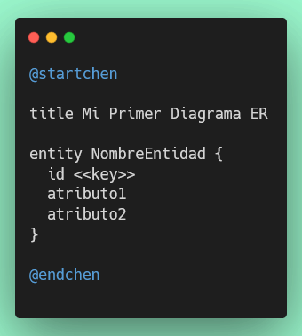
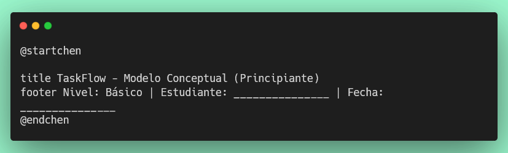
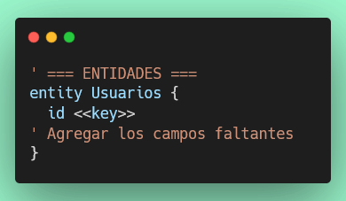
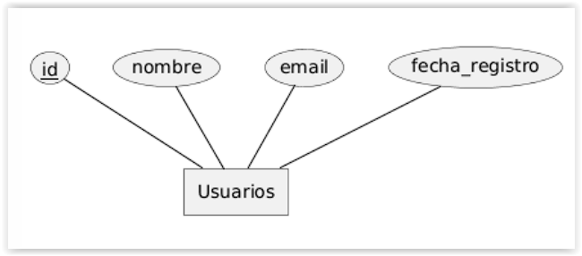
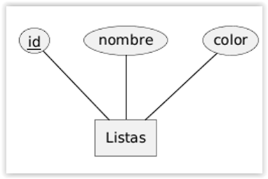
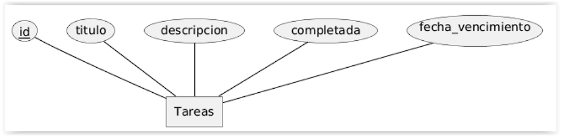
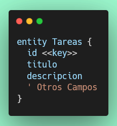
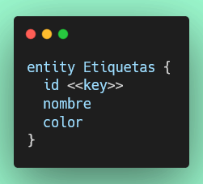
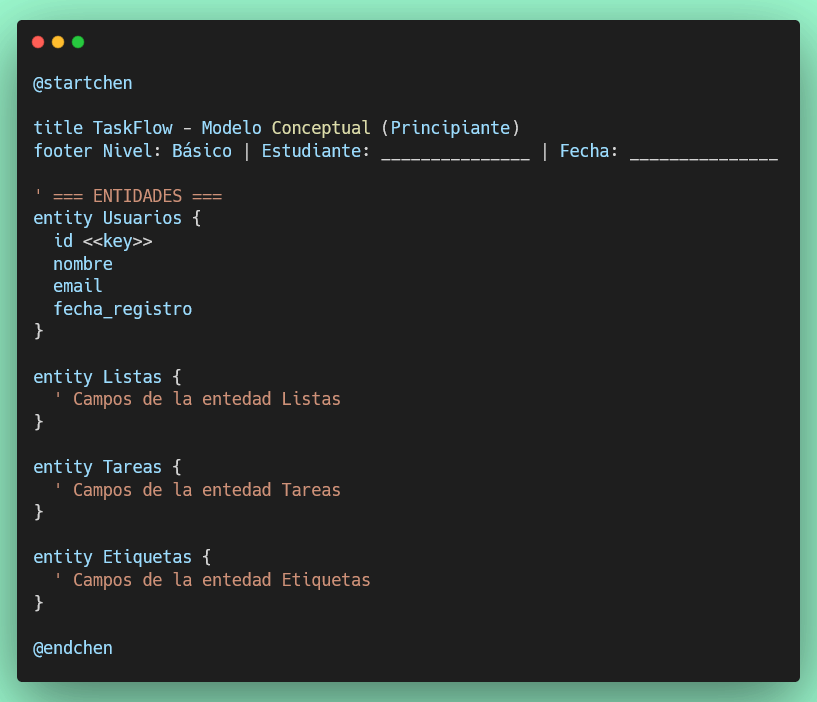

# Ejercicio 1: Diagrama ER (Chen) — TaskFlow

## ¿Cómo visualizar Diagramas PlantUML?

**¡IMPORTANTE!** Para visualizar tus diagramas PlantUML en VS Code:

1. **Instala la extensión PlantUML** (si aún no la tienes)
2. **Abre tu archivo `.puml`** en el editor
3. **Presiona `Alt + D`** para ver la vista previa en tiempo real
4. También puedes usar: `Ctrl+Shift+P` → `PlantUML: Preview Current Diagram`

💡 La vista previa se actualizará automáticamente cada vez que guardes cambios.

Nota: Si no puede visualizar el diagrama en el visor de VS Code, copia y pega tu código PlantUML en la pagina web de PlantUML: https://www.plantuml.com/plantuml/uml

---

## Objetivo

Crear un **Diagrama Entidad-Relación en notación Chen** usando PlantUML que modele las cuatro entidades base de **TaskFlow**, una aplicación de gestión de tareas.

## Objetivos de Aprendizaje

Al finalizar, serás capaz de:

- ✅ Identificar entidades, atributos y claves primarias en un contexto real.
- ✅ Representar entidades con la sintaxis `@startchen`.
- ✅ Entender cómo una relación conceptual se traduce a tablas SQL.
- ✅ Validar tu diagrama sin errores de sintaxis.d

---

## ¿Qué es un Diagrama ER en Notación Chen?

Un **Diagrama Entidad-Relación (DER)** en notación Chen es una forma estándar de modelar la estructura de datos de un sistema. Fue propuesto por Peter Chen en 1976 y utiliza los siguientes elementos visuales:

| Símbolo               | Significado                              |
|-----------------------|------------------------------------------|
| Rectángulo            | Entidad (objeto del mundo real)          |
| Elipse                | Atributo (propiedad de la entidad)       |
| Elipse subrayada      | Atributo clave (identificador único, PK) |
| Rombo                 | Relación entre entidades                 |
| Línea                 | Conexión entre elementos                 |

### ¿Para qué sirve?

- Comunicar la estructura de la base de datos antes de escribir código.
- Identificar qué datos necesita guardar el sistema.
- Detectar relaciones entre objetos del dominio.

---

## Sintaxis `@startchen` en PlantUML

PlantUML soporta diagramas ER con notación Chen usando los delimitadores `@startchen` y `@endchen`.

### Estructura mínima



### Elementos clave de la sintaxis

| Elemento           | Descripción                                        |
|--------------------|----------------------------------------------------|
| `entity Nombre {}` | Define una entidad (rectángulo en el diagrama)     |
| `<<key>>`          | Marca el atributo como clave primaria (subrayado)  |
| `title`            | Agrega un título al diagrama                       |
| `footer`           | Agrega un pie de página                            |
| `' comentario`     | Línea de comentario (no aparece en el diagrama)    |

> 📌 Los atributos definidos dentro de `{}` aparecen como **elipses** alrededor de la entidad.
> El atributo con `<<key>>` se muestra **subrayado**, indicando que es la clave primaria.

---

## Instrucciones Paso a Paso para nuestro proyecto final.

### Paso 1: Crear el Archivo

Crea el archivo **`taskflow-conceptual.puml`** dentro de la carpeta **`diagramas/der/`**.

```
tu-repositorio/
└── diagramas/
    └── der/
        └── taskflow-conceptual.puml   ← este archivo
```

> 💡 Si la carpeta `diagramas/der/` no existe, créala manualmente desde el explorador de VS Code o con el terminal:
> ```bash
> mkdir -p diagramas/der
> ```

---

### Paso 2: Estructura Básica

Abre el archivo y escribe la estructura inicial con el título y el pie de página:



Guarda (`Ctrl+S`) y presiona `Alt + D` para abrir la vista previa.
Deberías ver solo el título y el pie de página en un diagrama vacío.

---

### Paso 3: Agregar la Entidad `Usuarios`

Un usuario es quien accede a la aplicación. Tiene un identificador único, nombre, correo electrónico y la fecha en que se registró.

#### Campos
```text
  id (clave primaria)
  nombre
  email
  fecha_registro
```
Agrega esta entidad **entre el footer y el `@endchen`**:



Guarda y observa cómo aparece la entidad con sus atributos en la vista previa.

> 📌 `id <<key>>` se mostrará **subrayado** en el diagrama, indicando que es la clave primaria (identificador único de cada usuario).


---

### Paso 4: Agregar la Entidad `Listas`

Las listas agrupan tareas relacionadas (ej.: "Trabajo", "Personal", "Compras"). Cada lista tiene un nombre y un color para distinguirla visualmente.

Agrega la entidad `Listas` a continuación de `Usuarios`:

```text
  id (clave primaria)
  nombre
  color
```
Deberías ver ambas entidades con sus atributos en la vista previa:



---

### Paso 5: Agregar la Entidad `Tareas`

La tarea es el elemento central de la aplicación. Tiene un título obligatorio, una descripción opcional, un indicador de si ya fue completada y una fecha de vencimiento.



*Campos:*

```text
  id (clave primaria)
  titulo
  descripcion
  completada
  fecha_vencimiento
```



> 🤔 **Reflexiona:** ¿Qué tipo de dato usarías en SQL para `completada`? (Pista: solo puede ser `true` o `false`)

---

### Paso 6: Agregar la Entidad `Etiquetas`

Las etiquetas (o *tags*) permiten categorizar las tareas de forma flexible. Una tarea puede tener varias etiquetas y una etiqueta puede aplicarse a varias tareas.



---

## Resultado Esperado

Al completar todos los pasos, tu archivo `taskflow-conceptual.puml` debe verse así:



El diagrama mostrará las cuatro entidades con sus atributos distribuidos como elipses alrededor de cada rectángulo de entidad.

---

## Criterios de Evaluación

Tu diagrama será evaluado automáticamente verificando:

1. ✅ La carpeta `diagramas/der/` existe
2. ✅ El archivo `diagramas/der/taskflow-conceptual.puml` existe
3. ✅ Delimitadores correctos: `@startchen` y `@endchen`
4. ✅ Título que contiene "TaskFlow"
5. ✅ Footer con "Nivel: Básico"
6. ✅ Las 4 entidades definidas: `Usuarios`, `Listas`, `Tareas`, `Etiquetas`
7. ✅ Las 4 entidades tienen `id <<key>>` como clave primaria
8. ✅ Atributos correctos en `Usuarios`: `nombre`, `email`, `fecha_registro`
9. ✅ Atributos correctos en `Listas`: `nombre`, `color`
10. ✅ Atributos correctos en `Tareas`: `titulo`, `descripcion`, `completada`, `fecha_vencimiento`
11. ✅ Atributos correctos en `Etiquetas`: `nombre`, `color`

---

## Ejecución de Pruebas

Para verificar tu solución ejecuta:

```bash
npm test tests/ejercicio/1-diagrama-der-taskflow.test.js
```

---

## Consejos

- Usa comentarios (`'`) para organizar tu código en secciones.
- Verifica la **ortografía exacta** de los nombres (mayúsculas, guiones bajos).
- `Usuarios` ≠ `usuarios` — PlantUML distingue mayúsculas de minúsculas.
- El `<<key>>` debe estar junto al nombre del atributo sin espacios adicionales entre `<<` y `key`.
- Previsualiza tu diagrama con `Alt+D` en VS Code después de cada cambio.

## Recursos

- [PlantUML Chen Notation](https://plantuml.com/ie-diagram)
- [Diagramas ER — Notación Chen](https://es.wikipedia.org/wiki/Modelo_entidad-relaci%C3%B3n)
- [Tipos de datos SQL comunes](https://www.w3schools.com/sql/sql_datatypes.asp)

¡Buena suerte!
