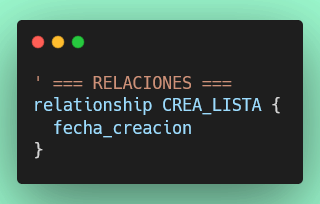
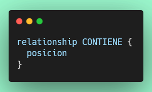
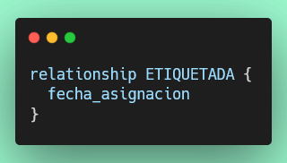
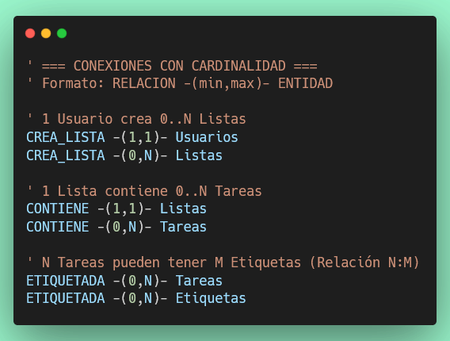

# Ejercicio 2: Relaciones y Cardinalidad — TaskFlow

## Objetivo

Extender el diagrama ER del Ejercicio 1 agregando **relaciones entre entidades** y definiendo su **cardinalidad**, completando así el modelo conceptual de TaskFlow.

## Objetivos de Aprendizaje

Al finalizar, serás capaz de:

- ✅ Representar relaciones en notación Chen con la palabra clave `relationship`.
- ✅ Agregar atributos propios a una relación.
- ✅ Expresar cardinalidad mínima y máxima con la sintaxis `-(min,max)-`.
- ✅ Identificar relaciones 1:N y N:M en un sistema real.

---

## Conceptos Clave

### ¿Qué es una Relación?

Una **relación** conecta dos entidades y describe cómo interactúan. En el diagrama se representa con un **rombo**.

Ejemplo: *Un Usuario **crea** una Lista.*

### ¿Qué es la Cardinalidad?

La **cardinalidad** indica cuántas instancias de una entidad pueden participar en la relación.

| Notación   | Significado                          |
|------------|--------------------------------------|
| `(1,1)`    | Exactamente uno (obligatorio)        |
| `(0,1)`    | Cero o uno (opcional)                |
| `(0,N)`    | Cero o muchos                        |
| `(1,N)`    | Uno o muchos (al menos uno)          |

### Cómo se lee la cardinalidad en notación Chen

```
RELACION -(min,max)- ENTIDAD
```

Ejemplo:
```
CREA_LISTA -(1,1)- Usuarios   ' Un usuario crea la lista (exactamente 1)
CREA_LISTA -(0,N)- Listas     ' La lista puede ser creada 0 o N veces
```

> 📌 Se lee **desde la relación hacia la entidad**: "En CREA_LISTA, participa **(1,1)** Usuarios", es decir, cada instancia de esta relación involucra exactamente 1 usuario.

### Tipos de relaciones según cardinalidad

| Tipo  | Ejemplo en TaskFlow               |
|-------|-----------------------------------|
| 1:N   | Un Usuario crea muchas Listas     |
| 1:N   | Una Lista contiene muchas Tareas  |
| N:M   | Muchas Tareas tienen muchas Etiquetas |

### Atributos en una Relación

Una relación también puede tener **atributos propios**: datos que pertenecen a la conexión, no a ninguna entidad por separado.

```plantuml
relationship ETIQUETADA {
  fecha_asignacion   ' ¿Cuándo se etiquetó esta tarea?
}
```

---

## Instrucciones Paso a Paso

> Abre el archivo `diagramas/der/taskflow-conceptual.puml` del Ejercicio 1 y agrega el contenido a continuación de las entidades, **antes del `@endchen`**.

---

### Paso 1: Agregar la Relación `CREA_LISTA`

Un usuario crea listas. Esta relación tiene un atributo `fecha_creacion` que guarda cuándo fue creada la lista.

Agrega esto **antes del `@endchen`**:



---

### Paso 2: Agregar la Relación `CONTIENE`

Una lista contiene tareas. La relación tiene un atributo `posicion` que indica el orden de la tarea dentro de la lista.



---

### Paso 3: Agregar la Relación `ETIQUETADA`

Una tarea puede tener muchas etiquetas, y una etiqueta puede aplicarse a muchas tareas. Esta es una relación **N:M**. Registra la `fecha_asignacion` en que se aplicó la etiqueta.



---

### Paso 4: Agregar las Conexiones con Cardinalidad

Ahora conecta las relaciones con sus entidades indicando la cardinalidad:




> 🤔 **Reflexiona:** ¿Por qué `ETIQUETADA` tiene `(0,N)` en ambos lados?
> Porque una tarea puede tener cero o muchas etiquetas, Y una etiqueta puede estar en cero o muchas tareas.

---

## De Diagrama a SQL

Cada relación en el diagrama tiene su equivalente en SQL:

| Relación     | En SQL                                                                       |
|--------------|------------------------------------------------------------------------------|
| `CREA_LISTA` | Columna `usuario_id` (FK) en la tabla `Listas`                               |
| `CONTIENE`   | Columnas `lista_id` (FK) y `posicion` en la tabla `Tareas`                   |
| `ETIQUETADA` | Tabla intermedia `tarea_etiqueta(tarea_id, etiqueta_id, fecha_asignacion)` |

> 📌 Las relaciones **N:M** (`ETIQUETADA`) **siempre** requieren una tabla intermedia en SQL.

---

## Criterios de Evaluación

Tu diagrama será evaluado automáticamente verificando:

1. ✅ Las 3 relaciones definidas: `CREA_LISTA`, `CONTIENE`, `ETIQUETADA`
2. ✅ Atributo `fecha_creacion` en la relación `CREA_LISTA`
3. ✅ Atributo `posicion` en la relación `CONTIENE`
4. ✅ Atributo `fecha_asignacion` en la relación `ETIQUETADA`
5. ✅ Cardinalidad `(1,1)` entre `CREA_LISTA` y `Usuarios`
6. ✅ Cardinalidad `(0,N)` entre `CREA_LISTA` y `Listas`
7. ✅ Cardinalidad `(1,1)` entre `CONTIENE` y `Listas`
8. ✅ Cardinalidad `(0,N)` entre `CONTIENE` y `Tareas`
9. ✅ Cardinalidad `(0,N)` entre `ETIQUETADA` y `Tareas`
10. ✅ Cardinalidad `(0,N)` entre `ETIQUETADA` y `Etiquetas`

---

## Ejecución de Pruebas

Para verificar tu solución ejecuta:

```bash
npm test tests/ejercicio/2-relaciones-taskflow.test.js
```

Para verificar que el ejercicio 1 sigue siendo correcto:

```bash
npm test
```

---

## Consejos

- Agrega las relaciones y conexiones **al final del archivo**, antes del `@endchen`.
- Respeta las **mayúsculas exactas** de los nombres: `CREA_LISTA`, `CONTIENE`, `ETIQUETADA`.
- Los comentarios con `'` ayudan a organizar el diagrama visualmente.
- Verifica la sintaxis: `RELACION -(min,max)- ENTIDAD` (sin espacios dentro de los paréntesis).

## Recursos

- [PlantUML ER Notation](https://plantuml.com/ie-diagram)
- [Cardinalidad en ER — Wikipedia](https://es.wikipedia.org/wiki/Modelo_entidad-relaci%C3%B3n#Cardinalidad_de_las_relaciones)

¡Buena suerte!
