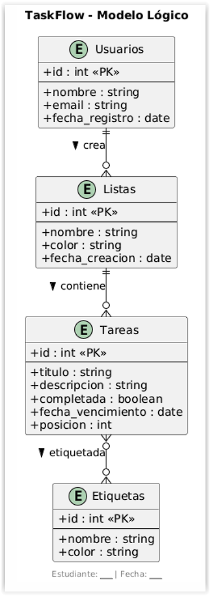
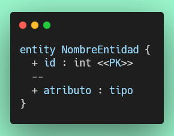
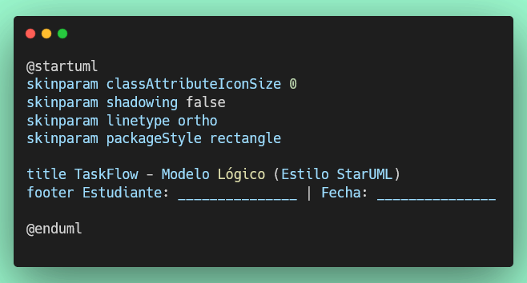
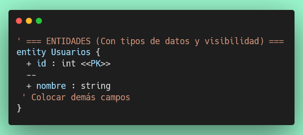
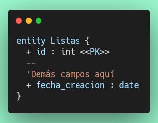
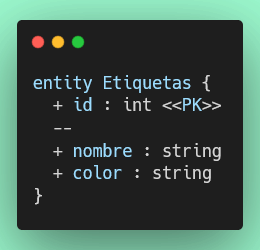
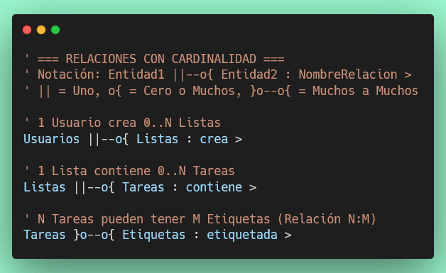
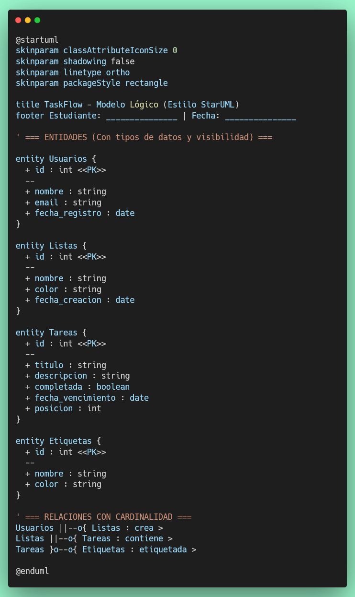

# Ejercicio 3: Modelo Lógico — TaskFlow

## Objetivo

Crear un **Modelo Lógico** de TaskFlow usando PlantUML con estilo StarUML. A diferencia del Ejercicio 1 (notación Chen conceptual), aquí trabajarás con **tipos de datos**, **visibilidad de atributos** y **notación de cardinalidad en línea**, acercándote más a un diseño de base de datos real.



## Objetivos de Aprendizaje

Al finalizar, serás capaz de:

- ✅ Crear un diagrama de modelo lógico con `@startuml` y `entity`.
- ✅ Declarar atributos con tipos de datos (`int`, `string`, `boolean`, `date`).
- ✅ Marcar claves primarias con `<<PK>>`.
- ✅ Usar la notación de cardinalidad crow's foot (`||--o{`, `}o--o{`).
- ✅ Entender qué atributos "migran" de las relaciones a las tablas al pasar al modelo lógico.

---

## Del Modelo Conceptual al Modelo Lógico

En el Ejercicio 1 modelaste las entidades de forma **conceptual** (sin tipos de datos, sin pensar en tablas SQL). En este ejercicio das el siguiente paso: el **modelo lógico**, que ya incorpora:

| Aspecto                  | Conceptual (Ej. 1)        | Lógico (Ej. 3)                     |
|--------------------------|---------------------------|------------------------------------|
| Tipos de datos           | No hay                    | `int`, `string`, `boolean`, `date` |
| Clave primaria           | `<<key>>`                 | `<<PK>>`                           |
| Atributos de relaciones  | En el rombo               | Migran a la entidad o tabla intermedia |
| Cardinalidad             | `-(0,N)-` junto al rombo  | Símbolos en la línea: `||--o{`     |
| Formato                  | `@startchen`              | `@startuml` con `entity`           |

### Migración de atributos

Cuando pasamos del modelo conceptual al lógico, los **atributos de las relaciones** se mueven:

- `CREA_LISTA.fecha_creacion` → columna `fecha_creacion` en la tabla **Listas**
- `CONTIENE.posicion` → columna `posicion` en la tabla **Tareas**
- `ETIQUETADA.fecha_asignacion` → columna `fecha_asignacion` en la tabla intermedia **tarea_etiqueta** (se crearía como 5ª tabla)

---

## Sintaxis Clave

### Definición de entidades con tipos



| Símbolo | Significado  |
|---------|--------------|
| `+`     | Público      |
| `--`    | Separador visual (PK / resto de campos) |
| `<<PK>>`| Clave primaria |

### Notación Crow's Foot (cardinalidad en línea)

```plantuml
EntidadA ||--o{ EntidadB : nombre_relacion >
```

| Símbolo  | Significado          |
|----------|----------------------|
| `\|\|`    | Exactamente uno (1)  |
| `o\|`     | Cero o uno (0..1)    |
| `o{`     | Cero o muchos (0..N) |
| `\|{`    | Uno o muchos (1..N)  |
| `}o--o{` | Muchos a muchos (N:M)|

---

## Instrucciones Paso a Paso

### Paso 1: Crear el Archivo

Crea el archivo **`taskflow-logico.puml`** en la misma carpeta `diagramas/der/`.

```
diagramas/
└── der/
    ├── taskflow-conceptual.puml   ← Ejercicio 1 y 2
    └── taskflow-logico.puml       ← este archivo (Ejercicio 3)
```

---

### Paso 2: Configuración Inicial

Este diagrama usa `@startuml` con configuraciones visuales que imitan el estilo limpio de StarUML:




> 📌 `skinparam linetype ortho` hace que las líneas de relación sean rectas (ortogonales), como en StarUML.

---

### Paso 3: Entidad `Usuarios`

Agrega la entidad con tipos de datos y visibilidad `+` (público):



---

### Paso 4: Entidad `Listas`

Nota que `fecha_creacion` ahora está aquí, **migrado** desde la relación `CREA_LISTA` del ejercicio anterior:


---

### Paso 5: Entidad `Tareas`

El atributo `posicion` fue migrado desde la relación `CONTIENE`:



> 🤔 **Reflexiona:** ¿Por qué `posicion` está en `Tareas` y no en `Listas`? Porque indica el orden de **esa tarea** dentro de una lista.

---

### Paso 6: Entidad `Etiquetas`



---

### Paso 7: Relaciones con Cardinalidad

Agrega las relaciones usando la notación crow's foot. Colócalas después de todas las entidades:



---

## Resultado Esperado

Tu archivo completo `taskflow-logico.puml`:



---

## Diferencias entre los tres diagramas

| Aspecto              | Ejercicio 1 (Conceptual) | Ejercicio 2 (Relaciones) | Ejercicio 3 (Lógico)      |
|----------------------|--------------------------|--------------------------|---------------------------|
| Formato              | `@startchen`             | `@startchen`             | `@startuml`               |
| Tipos de datos       | No                       | No                       | Sí (`int`, `string`, ...) |
| Clave primaria       | `<<key>>`                | `<<key>>`                | `<<PK>>`                  |
| Relaciones           | Solo entidades           | Rombos con atributos     | Líneas crow's foot        |
| Atributos de relación| —                        | En el rombo              | Migrados a la entidad     |

---

## Criterios de Evaluación

Tu diagrama será evaluado automáticamente verificando:

1. ✅ El archivo `diagramas/der/taskflow-logico.puml` existe
2. ✅ Delimitadores `@startuml` y `@enduml`
3. ✅ Título que contiene "TaskFlow" y "Lógico"
4. ✅ Configuración `skinparam classAttributeIconSize 0`
5. ✅ Configuración `skinparam linetype ortho`
6. ✅ Las 4 entidades con `<<PK>>`: `Usuarios`, `Listas`, `Tareas`, `Etiquetas`
7. ✅ Tipos de datos correctos en cada entidad
8. ✅ Atributo migrado `fecha_creacion` en `Listas`
9. ✅ Atributos migrados `posicion` y `completada : boolean` en `Tareas`
10. ✅ Relación 1:N `Usuarios ||--o{ Listas`
11. ✅ Relación 1:N `Listas ||--o{ Tareas`
12. ✅ Relación N:M `Tareas }o--o{ Etiquetas`

---

## Ejecución de Pruebas

```bash
npm test tests/ejercicio/3-modelo-logico-taskflow.test.js
```

Para ejecutar todos los ejercicios:

```bash
npm test
```

---

## Consejos

- Respeta la **ortografía y espaciado exacto** de la notación crow's foot: `||--o{`, `}o--o{`.
- El separador `--` dentro de la entidad es obligatorio para separar la PK del resto.
- Cada atributo lleva `+ nombre : tipo` (con espacios alrededor de `:`).
- Verifica que `fecha_creacion` esté en `Listas` y `posicion` esté en `Tareas`.

## Recursos

- [PlantUML Entity Diagrams](https://plantuml.com/ie-diagram)
- [Tipos de datos SQL](https://www.w3schools.com/sql/sql_datatypes.asp)

¡Buena suerte! 🚀
